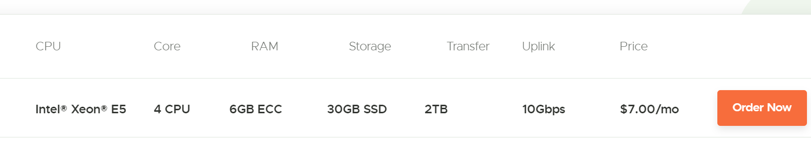
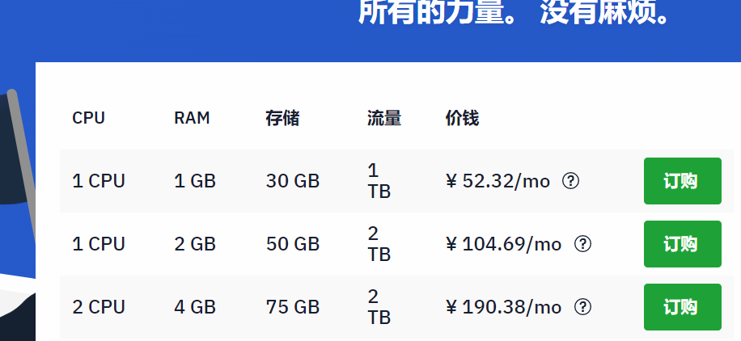

以下排名与介绍不分先后顺序，请PR的同僚按行文顺序依次向下添加即可

本篇的选择标准只有两个（需要同时满足）

1. 支持比特币等虚拟货币交易
2. 服务器地点处于国外且注册于国外

添加时请附上该供应商的最低配置机器和推荐配置（或热销配置）机器（推荐配置请以2-core + 2GB为基准）
还请特别注明结算周期是按月结算还是按年结算后平摊到每月，以及是否按年结算会打折等信息
同时还请说明是否原生支持Kali，以及是否允许自定义上传ISO镜像文件

### VPSDIME
[https://vpsdime.com/linux-vps]()

最低配置款 4-core 6GB $7/mo  按年结算时不打折
不原生支持Kali

### HostWinds
最低配置款 1-core 1GB 首月价格￥52/mo 续费时价格上调 按年结算时不打折
推荐配置款 2-core 4GB 首月￥190/mo 续费时价格上调 按年结算时不打折
不原生支持Kali，支持自定义上传ISO镜像

